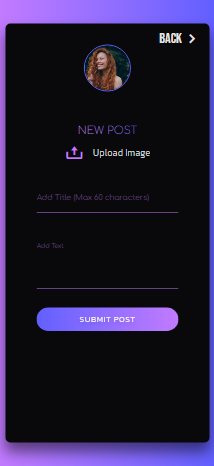

# News & Blogs App

## Overview

A news and blogs dashboard.

### Features

- Read GNews Headlines and articles from chosen categories
- Search news with keywords
- Bookmark articles
- Check the current weather
- Calendar
- Read, write, edit, delete blogs with images
- Responsive design

### Built with

- ReactJS
- Tailwind CSS

---

## Screenshots

**Desktop**

Top screen and news modal

  
  

 

Bookmarks

  

 

Post screen and blog modal

  
  

 

**Tablet and Mobile**

  
  
  
  

 
